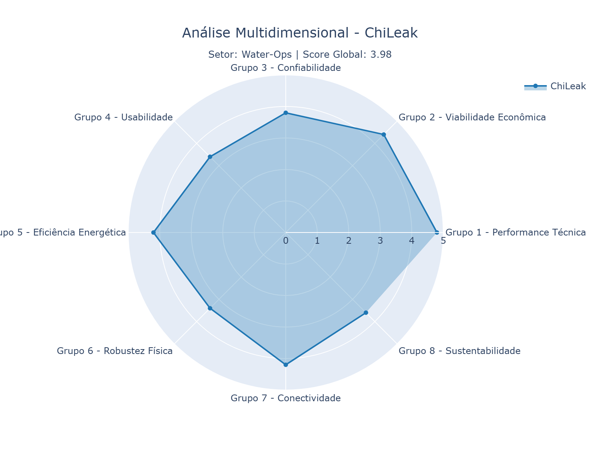
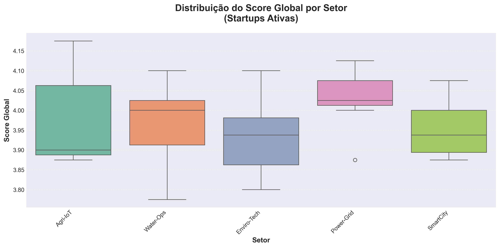
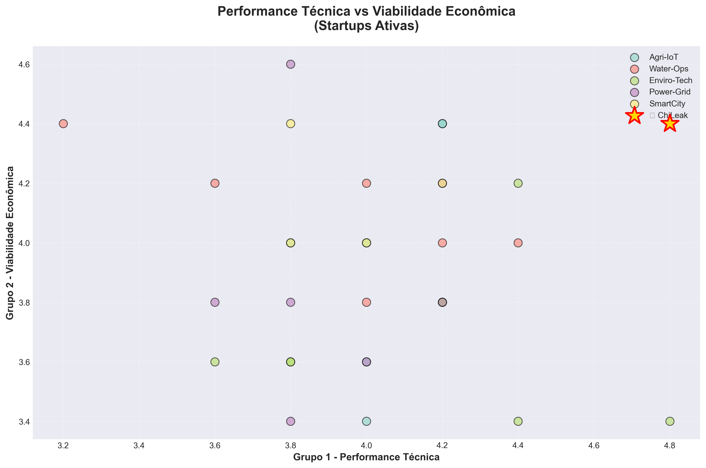

# 🚀 Case TechNova - Análise de Maturidade de Produtos IoT

[](https://www.python.org/)
[](https://pandas.pydata.org/)
[](https://www.sqlite.org/)
[](https://plotly.com/)

## 📋 Sobre o Projeto

Este projeto apresenta uma **análise completa de maturidade de produtos IoT** para a TechNova, uma empresa de venture capital especializada em investimentos em startups de tecnologia. O objetivo é identificar as melhores oportunidades de investimento com base em múltiplas dimensões de avaliação.

### 🎯 Objetivos

- ✅ Analisar dados de avaliação de startups IoT
- ✅ Identificar a melhor startup para investimento
- ✅ Criar visualizações interativas e estáticas
- ✅ Desenvolver sistema de banco de dados relacional
- ✅ Gerar insights sobre setores e riscos

## 🏗️ Estrutura do Projeto

```
Case_TechNova_Dados/
│
├── 📊 Dados
│   ├── Case_TechNova_Dados.xlsx              # Dados originais (71KB)
│   ├── startups_ativas_processadas.csv       # Startups ativas processadas
│   └── startups_inativas_processadas.csv     # Startups inativas processadas
│
├── 🗄️ Banco de Dados
│   ├── technova_iot.db                       # Banco SQLite
│   ├── criar_banco_dados.py                  # Script de criação do banco
│   ├── consultar_banco.py                    # Exemplos de consultas
│   ├── visualizador_banco.py                 # Interface interativa
│   └── README_BANCO_DADOS.md                 # Documentação do banco
│
├── 📈 Análises
│   ├── analise_maturidade_iot.py             # Análise principal
│   ├── explorar_dados.py                     # Exploração inicial
│   └── exploracao_dados.txt                  # Relatório de exploração
│
├── 📊 Visualizações
│   ├── radar_melhor_startup.html             # Gráfico radar interativo (4.8MB)
│   ├── radar_melhor_startup.png              # Gráfico radar estático
│   ├── boxplot_score_por_setor.png           # Boxplot por setor
│   └── scatter_performance_viabilidade.png   # Scatter plot
│
├── 📄 Documentação
│   ├── README.md                             # Este arquivo
│   ├── README_BANCO_DADOS.md                 # Docs do banco de dados
│   ├── requirements.txt                      # Dependências Python
│   └── Desafio de Data Analytics.pdf         # Descrição do case
│
└── 📓 Notebooks
    └── analise_completa.ipynb                # Jupyter Notebook
```

## 🎯 Principais Resultados

### 🏆 Melhor Startup Identificada

A análise identificou a startup com melhor equilíbrio entre **Performance Técnica** e **Viabilidade Econômica**, considerando 8 dimensões de avaliação:

1. **Performance Técnica** - Capacidade técnica do produto
2. **Viabilidade Econômica** - Sustentabilidade financeira
3. **Confiabilidade** - Estabilidade e consistência
4. **Usabilidade** - Facilidade de uso
5. **Eficiência Energética** - Consumo otimizado
6. **Robustez Física** - Durabilidade do hardware
7. **Conectividade** - Capacidades de comunicação
8. **Sustentabilidade** - Impacto ambiental

### 📊 Visualizações Geradas

#### Gráfico de Radar - Análise Multidimensional


#### Distribuição por Setor


#### Performance vs Viabilidade


## 🚀 Como Usar

### 1️⃣ Instalação

Clone o repositório e instale as dependências:

```bash
git clone https://github.com/elreis96/Case_TechNova_Dados.git
cd Case_TechNova_Dados
pip install -r requirements.txt
```

### 2️⃣ Executar Análise Completa

```bash
python analise_maturidade_iot.py
```

Este script irá:
- ✅ Carregar e processar os dados
- ✅ Calcular scores globais e por dimensão
- ✅ Identificar a melhor startup
- ✅ Gerar visualizações (HTML e PNG)
- ✅ Exportar dados processados (CSV)

### 3️⃣ Criar Banco de Dados

```bash
python criar_banco_dados.py
```

Cria um banco SQLite com:
- 4 tabelas relacionais
- Dados de todas as startups
- Estatísticas por setor
- Avaliações detalhadas

### 4️⃣ Consultar Dados

**Opção 1: Exemplos Prontos**
```bash
python consultar_banco.py
```

**Opção 2: Interface Interativa**
```bash
python visualizador_banco.py
```

### 5️⃣ Explorar Dados Iniciais

```bash
python explorar_dados.py
```

## 💾 Sistema de Banco de Dados

### Estrutura

O banco de dados `technova_iot.db` contém:

| Tabela | Descrição | Registros |
|--------|-----------|-----------|
| `startups` | Informações principais das startups | ~50 |
| `avaliacoes_dimensoes` | Scores por dimensão (8 grupos) | ~400 |
| `avaliacoes_detalhadas` | Scores individuais (critérios 1.1-8.5) | ~2000 |
| `estatisticas_setor` | Estatísticas agregadas por setor | ~10 |

### Exemplos de Consultas SQL

**Top 5 Startups Ativas:**
```sql
SELECT nome_startup, setor, score_global
FROM startups
WHERE status = 'Ativa'
ORDER BY score_performance_viabilidade DESC
LIMIT 5;
```

**Análise de Risco por Setor:**
```sql
SELECT setor, 
       COUNT(*) as total,
       100.0 * SUM(CASE WHEN status = 'Inativa' THEN 1 ELSE 0 END) / COUNT(*) as taxa_falha
FROM startups
GROUP BY setor
ORDER BY taxa_falha DESC;
```

**Startups Equilibradas (todas dimensões > 3.5):**
```sql
SELECT s.nome_startup, s.setor, s.score_global
FROM startups s
JOIN avaliacoes_dimensoes d ON s.id = d.startup_id
WHERE s.status = 'Ativa'
GROUP BY s.id
HAVING MIN(d.score) > 3.5;
```

Veja mais exemplos em [`README_BANCO_DADOS.md`](README_BANCO_DADOS.md)

## 📊 Integração com Power BI

O banco de dados SQLite pode ser **facilmente integrado ao Power BI** para criar dashboards interativos!

### 🚀 Início Rápido

**Opção 1: Usar CSVs Exportados (Mais Simples)**
```bash
python exportar_para_powerbi.py
```
Isso gera 7 arquivos CSV otimizados na pasta `powerbi_export/`:
- ✅ Tabelas principais (4 arquivos)
- ✅ View consolidada com todas as dimensões
- ✅ Análise por setor
- ✅ Ranking de startups

**Opção 2: Conexão Direta ao SQLite**
- Instale o driver ODBC SQLite
- No Power BI: **Obter Dados** → **ODBC** ou **SQLite**
- Selecione `technova_iot.db`

**Opção 3: Script Python no Power BI**
- Use o arquivo `powerbi_export/script_conexao_powerbi.py`
- No Power BI: **Obter Dados** → **Python Script**

### 📈 Recursos Disponíveis

- **Medidas DAX** pré-configuradas (KPIs, rankings, comparações)
- **Visualizações recomendadas** (radar, scatter, boxplot, heatmap)
- **Relacionamentos** entre tabelas configuráveis
- **Dashboard template** com layout sugerido

Veja o guia completo em [`GUIA_POWER_BI.md`](GUIA_POWER_BI.md)

## 📊 Metodologia de Análise

### 1. Tratamento de Dados
- Separação de startups ativas e inativas
- Limpeza e validação de dados
- Identificação de 40+ critérios de avaliação

### 2. Engenharia de Atributos
- **Score Global**: Média de todos os critérios (1.1 a 8.5)
- **Score por Dimensão**: Média dos critérios de cada grupo
- **Score Performance + Viabilidade**: Média dos Grupos 1 e 2

### 3. Análise Multidimensional
- Agregação por 8 dimensões principais
- Comparação entre setores
- Identificação de outliers e padrões

### 4. Visualização
- Gráficos de radar (Plotly interativo)
- Boxplots por setor (Matplotlib/Seaborn)
- Scatter plots de correlação

### 5. Recomendação
- Identificação da melhor oportunidade
- Análise de risco setorial
- Justificativa baseada em dados

## 🛠️ Tecnologias Utilizadas

| Tecnologia | Uso |
|------------|-----|
| **Python 3.8+** | Linguagem principal |
| **Pandas** | Manipulação e análise de dados |
| **NumPy** | Operações numéricas |
| **Matplotlib** | Visualizações estáticas |
| **Seaborn** | Visualizações estatísticas |
| **Plotly** | Gráficos interativos |
| **SQLite** | Banco de dados relacional |
| **openpyxl** | Leitura de arquivos Excel |
| **Kaleido** | Exportação de imagens Plotly |

## 📦 Dependências

```txt
pandas
matplotlib
seaborn
plotly
openpyxl
kaleido
```

Instalar todas de uma vez:
```bash
pip install -r requirements.txt
```

## 📈 Insights Principais

### ✅ Pontos Fortes Identificados
- Startups com equilíbrio entre performance técnica e viabilidade econômica
- Setores com menor taxa de falha
- Dimensões com melhor desempenho médio

### ⚠️ Riscos Identificados
- Setores com alta taxa de startups inativas
- Dimensões com scores baixos
- Desequilíbrios entre critérios técnicos e econômicos

### 💡 Recomendações
- Priorizar investimentos em startups equilibradas
- Considerar análise de risco setorial
- Monitorar dimensões críticas (Performance e Viabilidade)

## 🔧 Ferramentas Recomendadas

Para explorar o banco de dados graficamente:

- **[DB Browser for SQLite](https://sqlitebrowser.org/)** - Interface gráfica gratuita
- **[DBeaver](https://dbeaver.io/)** - Cliente universal de banco de dados
- **[SQLite Online](https://sqliteonline.com/)** - Visualizador web

## 📝 Arquivos Principais

### Scripts Python

| Arquivo | Descrição | Linhas |
|---------|-----------|--------|
| `analise_maturidade_iot.py` | Análise completa com visualizações | 290 |
| `criar_banco_dados.py` | Criação do banco SQLite | 350+ |
| `consultar_banco.py` | Exemplos de consultas | 200+ |
| `visualizador_banco.py` | Interface interativa CLI | 250+ |
| `explorar_dados.py` | Exploração inicial dos dados | 28 |

### Dados e Resultados

| Arquivo | Tipo | Tamanho |
|---------|------|---------|
| `Case_TechNova_Dados.xlsx` | Excel | 71 KB |
| `technova_iot.db` | SQLite | ~100 KB |
| `radar_melhor_startup.html` | HTML | 4.8 MB |
| `*.png` | Imagens | ~600 KB total |

## 🎓 Aprendizados

Este projeto demonstra:

- ✅ **Análise de Dados**: Manipulação e processamento de datasets complexos
- ✅ **Visualização**: Criação de gráficos interativos e estáticos
- ✅ **Banco de Dados**: Modelagem relacional e queries SQL
- ✅ **Engenharia de Software**: Código modular e reutilizável
- ✅ **Documentação**: READMEs completos e exemplos práticos

## 🤝 Contribuições

Sugestões e melhorias são bem-vindas! Sinta-se à vontade para:

1. Fazer fork do projeto
2. Criar uma branch para sua feature (`git checkout -b feature/MinhaFeature`)
3. Commit suas mudanças (`git commit -m 'Adiciona MinhaFeature'`)
4. Push para a branch (`git push origin feature/MinhaFeature`)
5. Abrir um Pull Request

## 📄 Licença

Este projeto é parte de um case de análise de dados para fins educacionais e de demonstração.

## 👤 Autor

**Eduardo Reis**

- GitHub: [@elreis96](https://github.com/elreis96)
- LinkedIn: [Eduardo Reis](https://www.linkedin.com/in/eduardo-reis96/)

## 📞 Contato

Para dúvidas ou sugestões sobre o projeto, abra uma issue no GitHub.

---

<div align="center">

**Desenvolvido com 💙 para TechNova**

*Análise de Maturidade de Produtos IoT - 2026*

</div>
